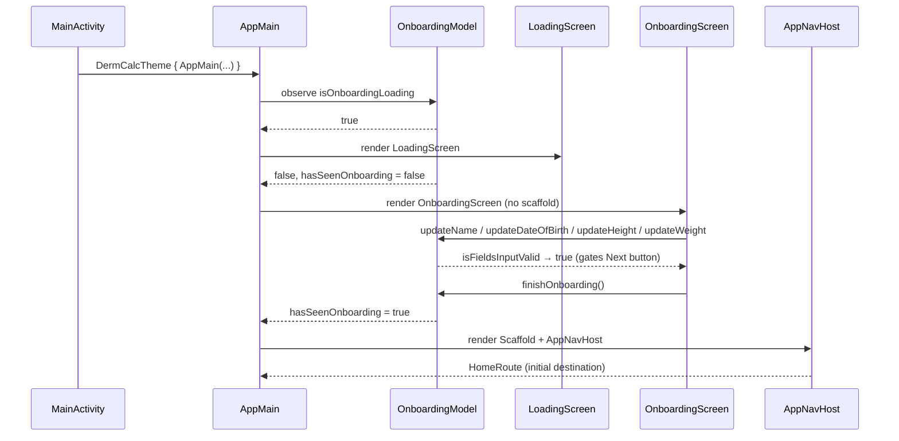
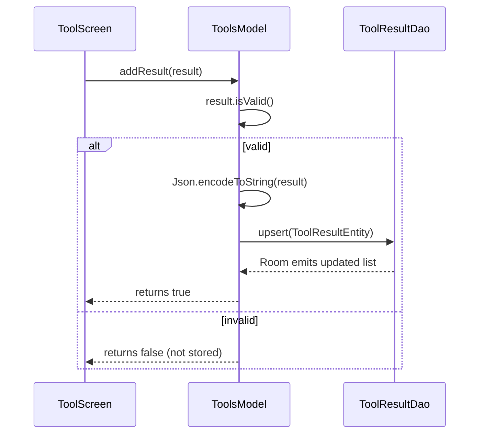
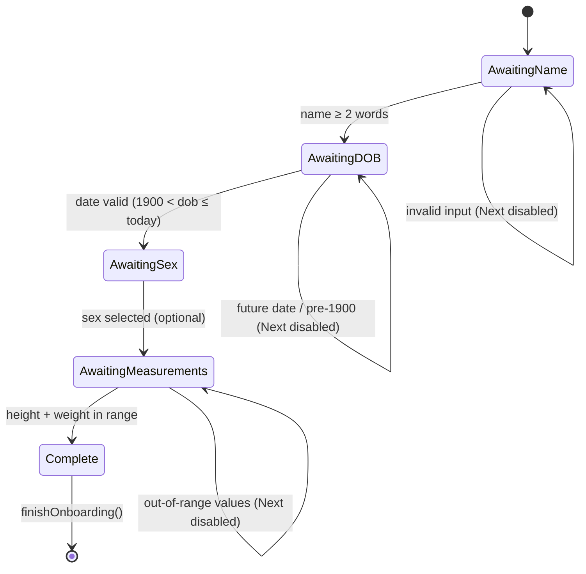

# DermCalc

[](https://www.gnu.org/licenses/agpl-3.0)


An Android app for dermatological score calculation and patient management, built with Jetpack Compose.

## Features

- **Patient profile** — onboarding flow collecting personal data (name, date of birth, sex); persisted to Room
- **BMI** — weight/height input, automatic classification (underweight / normal / overweight / obese)
- **BSA** — body surface area via interactive body diagram with per-region sliders
- **PASI** — multi-step calculator across four districts (head, upper limbs, trunk, lower limbs) with erythema, induration, desquamation and area scoring; severity classification (Mild <10 / Moderate 10–20 / Severe ≥20)
- **EASI** — identical structure to PASI with adjusted parameters (erythema, oedema/papulation, excoriation, lichenification; 0–3 scale)
- **History** — chronological log of all calculations with type, value, severity and date; full-screen overlay with per-entry deletion and clear-all

## Stack

- Kotlin + Jetpack Compose
- Navigation Compose (type-safe, kotlinx.serialization)
- ViewModel + StateFlow
- Room (KSP)
- Material 3

## Architecture

### Entry point

`MainActivity` is the single activity. On `onCreate` it creates the Room database singleton, a `DermCalcViewModelFactory`, and all four ViewModels. Theme dark/light state is persisted to `app_settings` via a coroutine collection loop; toggle writes back to Room. The root content is `DermCalcTheme { AppMain(...) }`.

`AppMain` reads `isOnboardingLoading` and `hasSeenOnboarding` from `OnboardingModel` and switches between three rendering paths:

- **Loading** → `LoadingScreen` (spinner while Room loads persisted state on first launch)
- **Onboarding not seen** → bare `OnboardingScreen` (no chrome, full-screen horizontal pager)
- **Onboarding complete** → `Box` with background image + transparent `Scaffold` (TopMenu, NavigationBar, AppNavHost)

### ViewModels

| ViewModel | Responsibility |
|---|---|
| `OnboardingModel` | Owns `List<InputField>` state flow; validates fields per page; persists profile and onboarding flag to Room; exposes `isOnboardingLoading` to gate the loading screen |
| `ToolsModel` | Persists `List<ToolResult>` to Room via DAO; holds PASI and EASI in-progress draft state across navigation; exposes reactive `pasiScore`, `easiScore`, `pasiHasData`, `easiHasData` flows |
| `QuoteModel` | Serves a randomly-selected dermatology quote from the string array resource; author parsed by splitting on em-dash |
| `BodyScanModel` | Holds mutable `BodyScanState` (per-region affected percentages + selected region); derives `BsaResult` on each state read; resets on `ON_STOP` lifecycle event |

### App startup sequence



### Calculator flow (addResult)



### Onboarding state machine



### Severity thresholds

| Tool | Mild    | Moderate | Severe         |
|------|---------|----------|----------------|
| PASI | < 10    | 10–20    | ≥ 20           |
| EASI | < 7     | 7–21     | ≥ 21           |
| BMI  | 18.5–25 | 25–30    | < 18.5 or ≥ 30 |
| BSA  | < 10 %  | 10–30 %  | ≥ 30 %         |

### Package layout

```
it.lcavagnari.pdm.dermcalc
├── MainActivity.kt               — single activity; theme toggle; ViewModel wiring
├── data/                         — Room: AppDatabase, DAOs, Entities, Converters, ViewModelFactory
├── models/                       — InputField, OnboardingModel, QuoteModel, ToolsModel/ToolResult, BodyScanModel, AppRoute
├── navigation/                   — AppNavHost
├── utils/                        — DateUtils (today() via kotlinx.datetime)
└── ui/
    ├── theme/                    — Color, Type, Theme (Material3), Souls, LocalCompositions
    ├── component/                — BorderedCard, BottomNavBar, HistoryCard, Tools, TopMenu
    │   └── input/                — BodyScanPicker, ButtonsTray, ConfirmButtons, DatePicker, InputFieldDialogs, SnapWheelPicker
    ├── onboarding/               — OnboardingItem, OnboardingPager
    ├── preview/                  — DermCalcPreview wrapper, PreviewFixtures
    └── screens/                  — HomeScreen, IndexToolScreen, IndexToolScreenScaffold, LoadingScreen,
                                    OnboardingScreen, ProfileScreen, QuickToolScreen, ToolsScreen
```

## API Reference

Full KDoc — classes, functions, parameters, and cross-references — is published at:

**[javacode-docsvault.vercel.app/projects/dermcalc/index.html](https://javacode-docsvault.vercel.app/projects/dermcalc/index.html)**

[](https://javacode-docsvault.vercel.app/projects/dermcalc/index.html)

Generated via Dokka. To rebuild locally: `.\gradlew dokkaHtml` → `app/build/dokka/html/`.

## Theme

DermCalc uses a custom Material 3 theme with subtle visual nods to Undertale — meaningful to those who notice, invisible to those who don't.

### Design language

- **App icon** — a red heart, readable as a medical symbol and as a soul
- **Typography** — Determination Mono used throughout the full type scale (display → label); JetBrains Mono available for clinical score readouts
- **Result cards** — white border on background, echoing the battle box aesthetic
- **Severity color mapping** — intentionally aligned with Undertale's own color language:
  - Mild → green
  - Moderate → yellow (`#ffff00` toned down for readability)
  - Severe → red

### Light / Dark mode

Both modes are supported. The theme adapts as follows:

| Element            | Light             | Dark                   |
|--------------------|-------------------|------------------------|
| Background         | off-white         | near-black (`#1a1a1a`) |
| Surface            | white             | dark grey              |
| Primary accent     | muted yellow-gold | bright yellow          |
| On-primary text    | black             | black                  |
| Severity: mild     | green             | green                  |
| Severity: moderate | amber             | yellow                 |
| Severity: severe   | red               | red                    |

Dark mode is the intended experience. Light mode is fully functional for clinical environments where a dark screen is impractical.

## Roadmap
- [X] Phase 1 — Project setup, navigation scaffold, empty screens
- [X] Phase 2 — Onboarding flow
- [X] Phase 3 — Profile screen (read + edit)
- [X] Phase 4 — Home screen (welcome, medical quote, history preview)
- [x] Phase 5 — BMI calculator end-to-end & BSA calculator
- [x] Phase 6 — PASI multi-step calculator
- [x] Phase 7 — EASI multi-step calculator
- [x] Phase 8 — Room profile & result storage
- [x] Phase 9 — Full history screen
- [x] Phase 10 — Polish (Material 3 theming, transitions, error handling)


## License

This project is licensed under the GNU Affero General Public License v3.0 (AGPLv3).

[LICENCE](LICENSE.md)

This means:
- You are free to use, modify, and distribute this software
- Any distributed or network-deployed modifications must also be open source under AGPLv3
- The source code must remain available under the same license

Copyright (C) 2026 Luca Cavagnari
