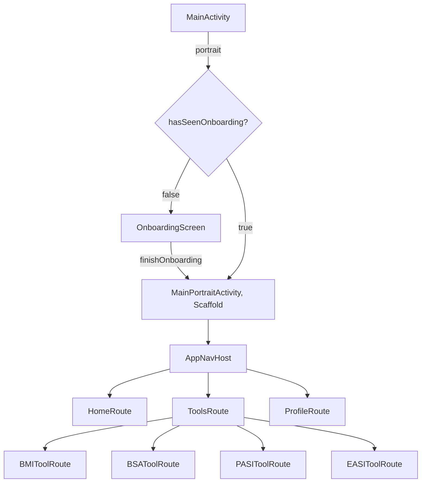
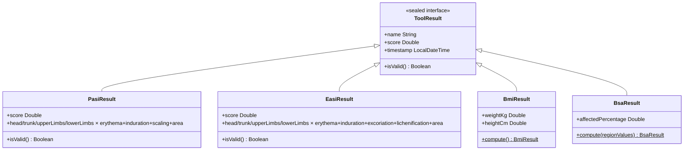
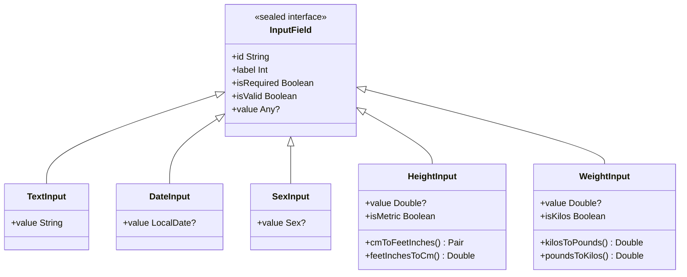

# DermCalc

An Android app for dermatological score calculation and patient management, built with Jetpack Compose.

## Features

- **Patient profile**, onboarding flow collecting personal data (name, date of birth, sex); held in-memory for the session (Room dependency included, persistence not yet implemented)
- **BMI**, weight/height input, automatic classification (underweight / normal / overweight / obese)
- **BSA**, body surface area via body region checklist (head, trunk, limbs, genitals)
- **PASI**, multi-step calculator across four districts (head, upper limbs, trunk, lower limbs) with erythema, induration, desquamation and area scoring; severity classification (Mild <10 / Moderate 10–20 / Severe ≥20)
- **EASI**, identical structure to PASI with adjusted parameters (erythema, oedema/papulation, excoriation, lichenification; 0–3 scale)
- **History**, chronological log of all calculations with type, value, severity and date; full history screen with deletion support when entries exceed 7

## Stack

- Kotlin + Jetpack Compose
- Navigation Compose
- ViewModel + StateFlow
- Room (KSP)
- Material 3

## Architecture

### Entry point & orientation

App currently supports only portrait mode, showing a stub when flipped to landscape. Portrait side observes `OnboardingModel.hasSeenOnboarding` and gates between `OnboardingScreen` and the main `Scaffold`.

`MainActivity` detects portrait/landscape and delegates to `MainPortraitActivity` or `MainLandscapeActivity`. 

### ViewModels

| ViewModel | Responsibility |
|---|---|
| `OnboardingModel` | Owns `List<InputField>` state flow; all values normalised to SI (cm, kg) on write; gates the onboarding pager via `isFieldsInputValid` |
| `ToolsModel` | In-memory `List<ToolResult>` state flow; `addResult` validates before appending; `deleteResult` removes by equality |
| `QuoteModel` | Serves a single random dermatology quote; must be explicitly refreshed via `updateQuote()` |

### Navigation graph



### Domain model



### Input field model



### Severity thresholds

| Tool | Mild | Moderate | Severe |
|---|---|---|---|
| PASI | < 10 | 10–20 | ≥ 20 |
| EASI | < 7 | 7–21 | ≥ 21 |
| BMI | 18.5–25 | 25–30 | < 18.5 or ≥ 30 |
| BSA | < 10 % | 10–30 % | ≥ 30 % |

### Package layout

```
it.lcavagnari.pdm.dermcalc
├── MainActivity.kt
├── models/          , InputField, OnboardingModel, QuoteModel, ToolsModel/ToolResult, AppRoute
├── utils/           , DateUtils (today() via kotlinx.datetime)
└── ui/
    ├── theme/       , Color, Type, Theme (Material3), LocalDarkTheme, LocalToggleDarkTheme
    ├── landscape/   , MainLandscapeActivity (stub)
    ├── shared/
    │   ├── navigation/  , AppNavHost, BottomNavBar
    │   └── component/   , SnapWheelPicker, DatePicker, BorderedCard, TopMenu, ButtonsTray, HistoryCard
    └── portrait/
        ├── MainPortraitActivity.kt
        ├── screens/     , HomeScreen, ToolsScreen, ProfileRoute, OnboardingScreen
        └── onboarding/  , OnboardingPager, OnboardingItem
```

## Kdoc Reference
Full KDoc, classes, functions, parameters, and cross-references, is published at:

**[javacode-docsvault.vercel.app/projects/dermcalc/index.html](https://javacode-docsvault.vercel.app/projects/dermcalc/index.html)**

Generated via Dokka. To rebuild locally: `.\gradlew dokkaHtml` → `app/build/dokka/html/`.

## Theme
DermCalc uses a custom Material 3 theme aimed to blend the retrò, blocky style inspired by the game Undertale to a medical / clynical look. 

### Design language

- **App icon**, a red heart with ECG signal, readable as a medical symbol
- **Typography**, Determination Mono font used throughout the full type scale (display → label); JetBrains Mono available for clinical score readouts
- **Severity color mapping**:
    - Normal/Mild → green
    - Moderate → yellow (`#ffff00` toned down for readability)
    - Severe → red

### Light / Dark mode

Both modes are supported. The theme adapts as follows:

| Element            | Light             | Dark                   |
|--------------------|-------------------|------------------------|
| Background         | off-white         | near-black (`#1a1a1a`) |
| Surface            | white             | dark grey              |
| Primary accent     | muted yellow-gold | bright yellow          |
| On-primary text    | black             | black                  |
| Severity: mild     | green             | green                  |
| Severity: moderate | amber             | yellow                 |
| Severity: severe   | red               | red                    |

Dark mode is the intended experience. Light mode is fully functional for clinical environments where a dark screen is impractical.

## Roadmap
- [X] Phase 1, Project setup, navigation scaffold, empty screens
- [X] Phase 2, Onboarding flow
- [X] Phase 3, Profile screen (read + edit)
- [X] Phase 4, Home screen (welcome, medical quote, history preview)
- [x] Phase 5, BMI calculator end-to-end & BSA calculator
- [ ] Phase 7, PASI multi-step calculator
- [ ] Phase 8, EASI multi-step calculator
- [ ] Phase 9, Full history screen and Room profile & result storage
- [ ] Phase 10, Polish (Material 3 theming, transitions, error handling)
